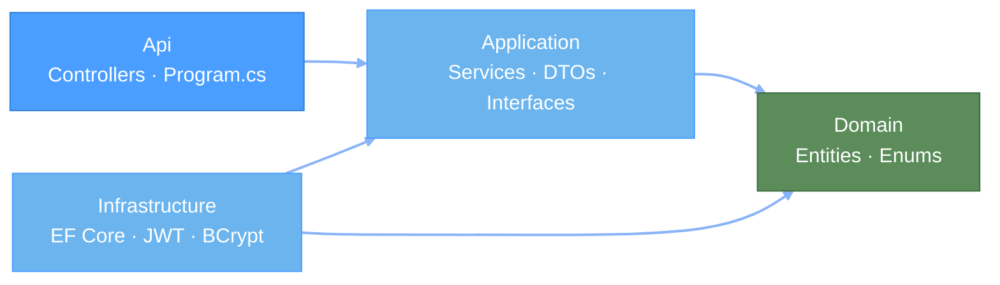

# MyWorkItem API

[](https://github.com/Neal75418/MyWorkItem/actions/workflows/ci.yml)

.NET 10 Web API — users view and confirm work items with personalized status; admins manage items via CRUD.

## Quick Start

### Docker Compose

Starts frontend + API + PostgreSQL with zero dependencies:

```bash
docker compose up --build
```

Open **http://localhost:3080**. Database auto-migrates and seeds demo data on first run.

### Local Development

Prerequisites: [.NET 10 SDK](https://dotnet.microsoft.com/download), PostgreSQL

```bash
cd src/MyWorkItem.Api
dotnet run
```

API at **http://localhost:5045** · OpenAPI spec at `/openapi/v1.json`

## Demo Accounts

| Username | Password | Role |
|----------|----------|------|
| `admin` | `admin123` | Admin |
| `user1` | `user123` | User |
| `user2` | `user123` | User |

## Architecture



Dependency direction: `Api → Application ← Infrastructure`, both depend on `Domain`.

## API Endpoints

| Method | Path | Description | Auth |
|--------|------|-------------|------|
| POST | `/api/auth/login` | Login, returns JWT | — |
| GET | `/api/auth/me` | Current user info | Bearer |
| GET | `/api/work-items` | List with personal status | Bearer |
| GET | `/api/work-items/{id}` | Detail | Bearer |
| POST | `/api/work-items/confirm` | Batch confirm | Bearer |
| PATCH | `/api/work-items/{id}/unconfirm` | Undo confirm | Bearer |
| GET | `/api/admin/work-items` | Admin list | Admin |
| POST | `/api/admin/work-items` | Create | Admin |
| PUT | `/api/admin/work-items/{id}` | Update | Admin |
| DELETE | `/api/admin/work-items/{id}` | Delete | Admin |

> Query params (GET `/api/work-items`): `sortBy` (`createdAt` | `title`), `sortDir` (`desc` | `asc`)
>
> Full spec: [docs/api-spec.md](docs/api-spec.md)

## Tech Stack

| Component | Technology |
|-----------|------------|
| Runtime | ASP.NET Core (.NET 10) |
| Database | PostgreSQL 18 · EF Core · Npgsql |
| Auth | JWT Bearer · BCrypt |
| Architecture | Clean Architecture (4 layers) |
| Tests | xUnit · NSubstitute · EF InMemory (20 tests) |
| DevOps | Docker Compose · GitHub Actions |

## Tests

```bash
dotnet test
```

20 unit tests covering `AuthService` (6) and `WorkItemService` (14).

## Design Decisions

| Decision | Choice | Rationale |
|----------|--------|-----------|
| Per-user status | Lazy creation (no record = Pending) | No background jobs needed |
| Password hash | BCrypt | Industry standard |
| Auth | JWT, 24h expiry | Stateless, SPA-friendly |
| Delete | Hard delete | Interview scope |

## Documentation

- [API Specification](docs/api-spec.md)
- [Architecture Diagrams (C4)](docs/c4-diagrams.md)
- [Database Schema](docs/database-schema.md)

## Related

Frontend: **[my-work-item-web](https://github.com/Neal75418/my-work-item-web)**
