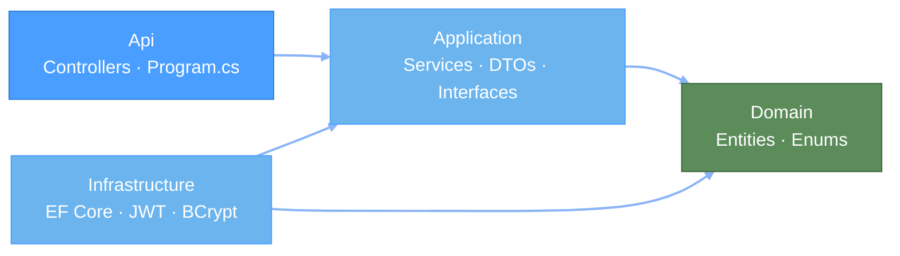

# MyWorkItem API

[](https://github.com/Neal75418/MyWorkItem/actions/workflows/ci.yml)

.NET 10 Web API — 使用者檢視並確認工作項目（個人化狀態）；管理員透過 CRUD 管理項目。

## 快速啟動

### Docker Compose

零依賴，一鍵啟動前端 + API + PostgreSQL：

```bash
docker compose up --build
```

開啟 **http://localhost:3080**，資料庫首次啟動時自動 migrate 並寫入示範資料。

### 本機開發

前置需求：[.NET 10 SDK](https://dotnet.microsoft.com/download)、PostgreSQL

```bash
cd src/MyWorkItem.Api
dotnet run
```

API：**http://localhost:5045** · OpenAPI：`/openapi/v1.json`

## 示範帳號

| 帳號 | 密碼 | 角色 |
|------|------|------|
| `admin` | `admin123` | Admin |
| `user1` | `user123` | User |
| `user2` | `user123` | User |

## 架構



依賴方向：`Api → Application ← Infrastructure`，兩者皆依賴 `Domain`。

## API 端點

| 方法 | 路徑 | 說明 | 認證 |
|------|------|------|------|
| POST | `/api/auth/login` | 登入，回傳 JWT | — |
| GET | `/api/auth/me` | 目前使用者資訊 | Bearer |
| GET | `/api/work-items` | 列表（含個人狀態） | Bearer |
| GET | `/api/work-items/{id}` | 詳情 | Bearer |
| POST | `/api/work-items/confirm` | 批次確認 | Bearer |
| PATCH | `/api/work-items/{id}/unconfirm` | 撤銷確認 | Bearer |
| GET | `/api/admin/work-items` | 管理列表 | Admin |
| POST | `/api/admin/work-items` | 新增 | Admin |
| PUT | `/api/admin/work-items/{id}` | 修改 | Admin |
| DELETE | `/api/admin/work-items/{id}` | 刪除 | Admin |

> 查詢參數（GET `/api/work-items`）：`sortBy`（`createdAt` | `title`）、`sortDir`（`desc` | `asc`）
>
> 完整規格：[docs/api-spec.md](docs/api-spec.md)

## 技術棧

| 元件 | 技術 |
|------|------|
| 執行環境 | ASP.NET Core（.NET 10） |
| 資料庫 | PostgreSQL 18 · EF Core · Npgsql |
| 認證 | JWT Bearer · BCrypt |
| 架構 | Clean Architecture（四層） |
| 測試 | xUnit · NSubstitute · EF InMemory（20 tests） |
| DevOps | Docker Compose · GitHub Actions |

## 測試

```bash
dotnet test
```

20 個 unit tests，涵蓋 `AuthService`（6）和 `WorkItemService`（14）。

## 關鍵設計決策

| 決策 | 選擇 | 理由 |
|------|------|------|
| 個人化狀態 | 延遲建立（無紀錄 = Pending） | 不需背景作業 |
| 密碼雜湊 | BCrypt | 業界標準 |
| 認證 | JWT，24 小時過期 | 無狀態，適合 SPA |
| 刪除策略 | 硬刪除 | 面試範圍，保持簡潔 |

## 文件

- [API 規格](docs/api-spec.md)
- [架構圖（C4）](docs/c4-diagrams.md)
- [資料庫 Schema](docs/database-schema.md)

## 相關專案

前端：**[my-work-item-web](https://github.com/Neal75418/my-work-item-web)**
