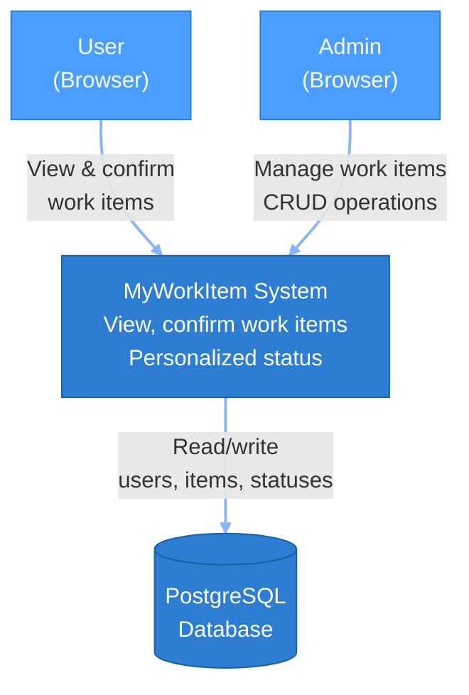
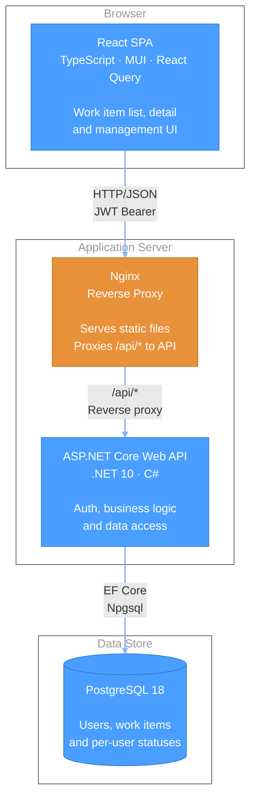
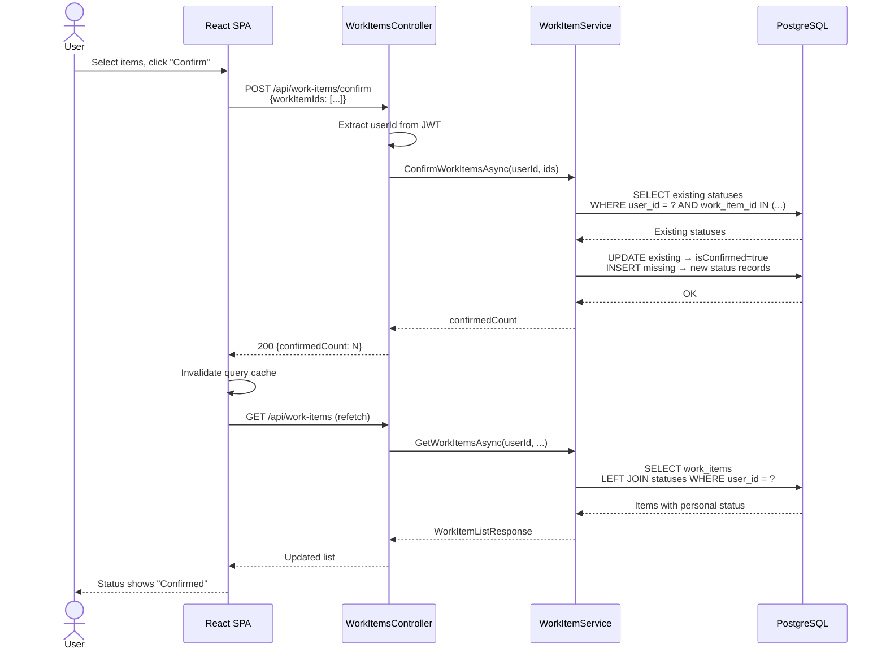
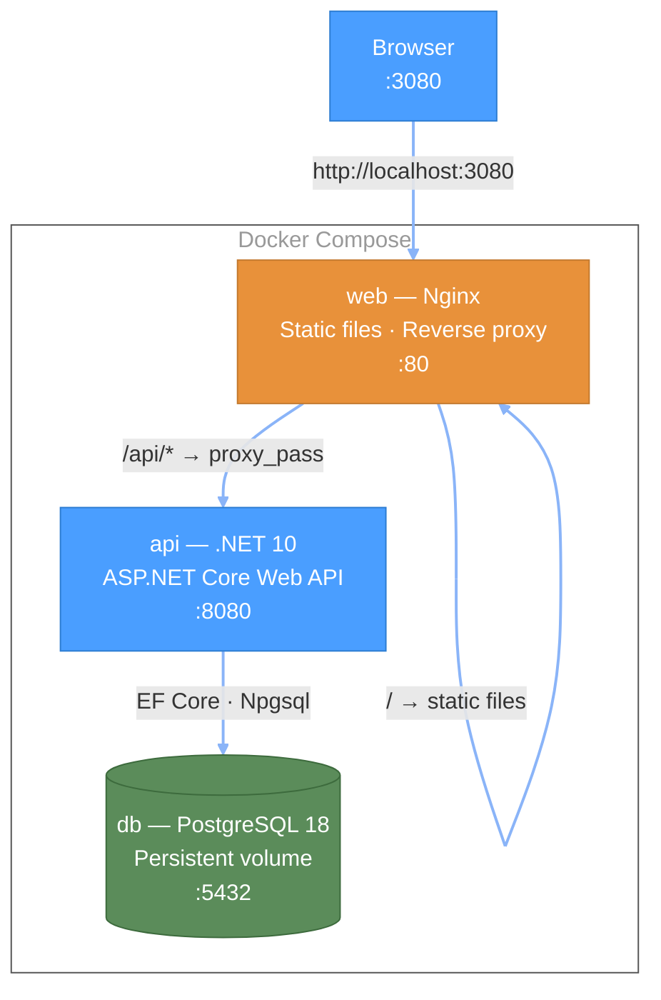

# C4 Architecture Diagrams

## Level 1 — System Context

## Level 2 — Container Diagram

## Level 3 — Component Diagram (Backend)

```mermaid
graph TB
    subgraph api["API Layer — MyWorkItem.Api"]
        AuthCtrl["AuthController\nLogin, current user"]
        WICtrl["WorkItemsController\nList, detail, confirm, undo"]
        AdminCtrl["AdminWorkItemsController\nCRUD operations"]
        JWTMiddleware["JWT Auth Middleware"]
    end

    subgraph app["Application Layer — MyWorkItem.Application"]
        AuthSvc["AuthService\nLogin validation, user lookup"]
        WISvc["WorkItemService\nList with personal status\nConfirm / undo logic"]
        AdminSvc["AdminWorkItemService\nCreate, update, delete"]
        IAppDb["IAppDbContext\nInterface"]
    end

    subgraph infra["Infrastructure Layer — MyWorkItem.Infrastructure"]
        DbCtx["AppDbContext\nEF Core DbContext"]
        TokenSvc["TokenService\nJWT generation"]
        PwdHash["BcryptPasswordHasher\nPassword hashing"]
        SeedData["SeedData\nDemo accounts & items"]
    end

    subgraph domain["Domain Layer — MyWorkItem.Domain"]
        UserEntity["User Entity"]
        WorkItemEntity["WorkItem Entity"]
        StatusEntity["UserWorkItemStatus Entity"]
        RoleEnum["UserRole Enum"]
    end

    AuthCtrl --> AuthSvc
    WICtrl --> WISvc
    AdminCtrl --> AdminSvc

    AuthSvc --> IAppDb
    AuthSvc --> TokenSvc
    AuthSvc --> PwdHash
    WISvc --> IAppDb
    AdminSvc --> IAppDb

    DbCtx -.->|"implements"| IAppDb
    DbCtx --> UserEntity
    DbCtx --> WorkItemEntity
    DbCtx --> StatusEntity

    style api fill:transparent,stroke:#555,color:#999
    style app fill:transparent,stroke:#555,color:#999
    style infra fill:transparent,stroke:#555,color:#999
    style domain fill:transparent,stroke:#555,color:#999

    style AuthCtrl fill:#4a9eff,stroke:#2d7dd2,color:#fff
    style WICtrl fill:#4a9eff,stroke:#2d7dd2,color:#fff
    style AdminCtrl fill:#4a9eff,stroke:#2d7dd2,color:#fff
    style JWTMiddleware fill:#4a9eff,stroke:#2d7dd2,color:#fff

    style AuthSvc fill:#6cb4ee,stroke:#4a9eff,color:#fff
    style WISvc fill:#6cb4ee,stroke:#4a9eff,color:#fff
    style AdminSvc fill:#6cb4ee,stroke:#4a9eff,color:#fff
    style IAppDb fill:#6cb4ee,stroke:#4a9eff,color:#fff

    style DbCtx fill:#6cb4ee,stroke:#4a9eff,color:#fff
    style TokenSvc fill:#6cb4ee,stroke:#4a9eff,color:#fff
    style PwdHash fill:#6cb4ee,stroke:#4a9eff,color:#fff
    style SeedData fill:#6cb4ee,stroke:#4a9eff,color:#fff

    style UserEntity fill:#5b8c5a,stroke:#3d6b3d,color:#fff
    style WorkItemEntity fill:#5b8c5a,stroke:#3d6b3d,color:#fff
    style StatusEntity fill:#5b8c5a,stroke:#3d6b3d,color:#fff
    style RoleEnum fill:#5b8c5a,stroke:#3d6b3d,color:#fff

    linkStyle default stroke:#8ab4f8,stroke-width:1.5px
```

## Data Flow — Confirm Work Items

## Deployment — Docker Compose

