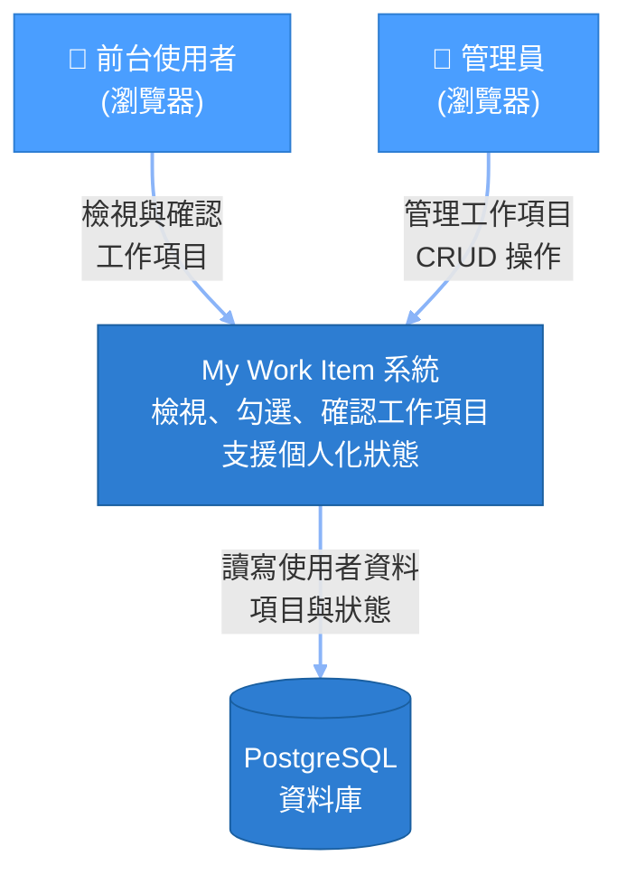
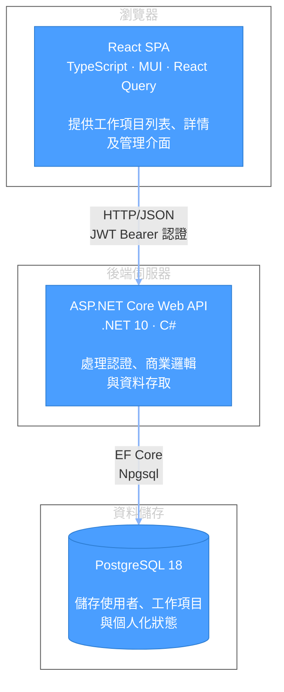
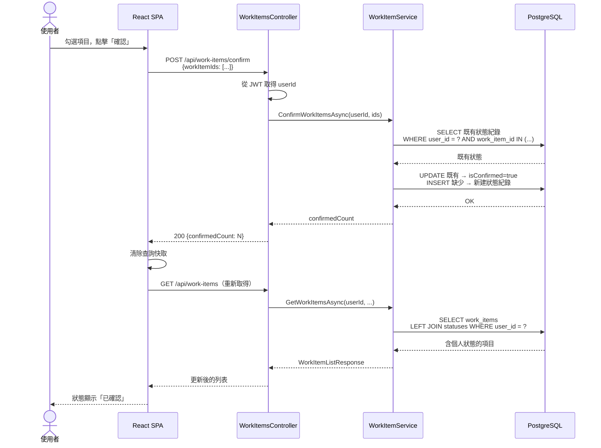

# C4 架構圖

## Level 1 — 系統情境圖

```mermaid
graph TB
    User["👤 前台使用者\n(瀏覽器)"]
    Admin["👤 管理員\n(瀏覽器)"]
    System["My Work Item 系統\n檢視、勾選、確認工作項目\n支援個人化狀態"]
    DB[("PostgreSQL\n資料庫")]

    User -->|"檢視與確認\n工作項目"| System
    Admin -->|"管理工作項目\nCRUD 操作"| System
    System -->|"讀寫使用者資料\n項目與狀態"| DB

    style User fill:#4a9eff,stroke:#2d7dd2,color:#fff
    style Admin fill:#4a9eff,stroke:#2d7dd2,color:#fff
    style System fill:#2d7dd2,stroke:#1a5fa0,color:#fff
    style DB fill:#2d7dd2,stroke:#1a5fa0,color:#fff

    linkStyle default stroke:#8ab4f8,stroke-width:2px
```

## Level 2 — 容器圖

```mermaid
graph TB
    subgraph browser["瀏覽器"]
        SPA["React SPA\nTypeScript · MUI · React Query\n\n提供工作項目列表、詳情\n及管理介面"]
    end

    subgraph server["後端伺服器"]
        API["ASP.NET Core Web API\n.NET 10 · C#\n\n處理認證、商業邏輯\n與資料存取"]
    end

    subgraph datastore["資料儲存"]
        PG[("PostgreSQL 18\n\n儲存使用者、工作項目\n與個人化狀態")]
    end

    SPA -->|"HTTP/JSON\nJWT Bearer 認證"| API
    API -->|"EF Core\nNpgsql"| PG

    style browser fill:transparent,stroke:#555,color:#ccc
    style server fill:transparent,stroke:#555,color:#ccc
    style datastore fill:transparent,stroke:#555,color:#ccc
    style SPA fill:#4a9eff,stroke:#2d7dd2,color:#fff
    style API fill:#4a9eff,stroke:#2d7dd2,color:#fff
    style PG fill:#4a9eff,stroke:#2d7dd2,color:#fff

    linkStyle default stroke:#8ab4f8,stroke-width:2px
```

## Level 3 — 元件圖（後端）

```mermaid
graph TB
    subgraph api["API 層 — MyWorkItem.Api"]
        AuthCtrl["AuthController\n登入、取得目前使用者"]
        WICtrl["WorkItemsController\n列表、詳情、確認、撤銷"]
        AdminCtrl["AdminWorkItemsController\nCRUD 操作"]
        JWTMiddleware["JWT 認證中介層"]
    end

    subgraph app["應用層 — MyWorkItem.Application"]
        AuthSvc["AuthService\n登入驗證、使用者查詢"]
        WISvc["WorkItemService\n列表（含個人狀態）\n確認/撤銷邏輯"]
        AdminSvc["AdminWorkItemService\n新增、修改、刪除"]
        IAppDb["IAppDbContext\n介面"]
    end

    subgraph infra["基礎設施層 — MyWorkItem.Infrastructure"]
        DbCtx["AppDbContext\nEF Core DbContext"]
        TokenSvc["TokenService\nJWT 產生"]
        PwdHash["BcryptPasswordHasher\n密碼雜湊"]
        SeedData["SeedData\n示範帳號與項目"]
    end

    subgraph domain["領域層 — MyWorkItem.Domain"]
        UserEntity["User 實體"]
        WorkItemEntity["WorkItem 實體"]
        StatusEntity["UserWorkItemStatus 實體"]
        RoleEnum["UserRole 列舉"]
    end

    AuthCtrl --> AuthSvc
    WICtrl --> WISvc
    AdminCtrl --> AdminSvc

    AuthSvc --> IAppDb
    AuthSvc --> TokenSvc
    AuthSvc --> PwdHash
    WISvc --> IAppDb
    AdminSvc --> IAppDb

    DbCtx -.->|"實作"| IAppDb
    DbCtx --> UserEntity
    DbCtx --> WorkItemEntity
    DbCtx --> StatusEntity

    style api fill:transparent,stroke:#555,color:#ccc
    style app fill:transparent,stroke:#555,color:#ccc
    style infra fill:transparent,stroke:#555,color:#ccc
    style domain fill:transparent,stroke:#555,color:#ccc

    style AuthCtrl fill:#4a9eff,stroke:#2d7dd2,color:#fff
    style WICtrl fill:#4a9eff,stroke:#2d7dd2,color:#fff
    style AdminCtrl fill:#4a9eff,stroke:#2d7dd2,color:#fff
    style JWTMiddleware fill:#4a9eff,stroke:#2d7dd2,color:#fff

    style AuthSvc fill:#6cb4ee,stroke:#4a9eff,color:#000
    style WISvc fill:#6cb4ee,stroke:#4a9eff,color:#000
    style AdminSvc fill:#6cb4ee,stroke:#4a9eff,color:#000
    style IAppDb fill:#6cb4ee,stroke:#4a9eff,color:#000

    style DbCtx fill:#6cb4ee,stroke:#4a9eff,color:#000
    style TokenSvc fill:#6cb4ee,stroke:#4a9eff,color:#000
    style PwdHash fill:#6cb4ee,stroke:#4a9eff,color:#000
    style SeedData fill:#6cb4ee,stroke:#4a9eff,color:#000

    style UserEntity fill:#5b8c5a,stroke:#3d6b3d,color:#fff
    style WorkItemEntity fill:#5b8c5a,stroke:#3d6b3d,color:#fff
    style StatusEntity fill:#5b8c5a,stroke:#3d6b3d,color:#fff
    style RoleEnum fill:#5b8c5a,stroke:#3d6b3d,color:#fff

    linkStyle default stroke:#8ab4f8,stroke-width:1.5px
```

## 資料流 — 確認工作項目

```mermaid
sequenceDiagram
    actor User as 使用者
    participant SPA as React SPA
    participant API as WorkItemsController
    participant Svc as WorkItemService
    participant DB as PostgreSQL

    User->>SPA: 勾選項目，點擊「確認」
    SPA->>API: POST /api/work-items/confirm<br/>{workItemIds: [...]}
    API->>API: 從 JWT 取得 userId
    API->>Svc: ConfirmWorkItemsAsync(userId, ids)
    Svc->>DB: SELECT 既有狀態紀錄<br/>WHERE user_id = ? AND work_item_id IN (...)
    DB-->>Svc: 既有狀態
    Svc->>DB: UPDATE 既有 → isConfirmed=true<br/>INSERT 缺少 → 新建狀態紀錄
    DB-->>Svc: OK
    Svc-->>API: confirmedCount
    API-->>SPA: 200 {confirmedCount: N}
    SPA->>SPA: 清除查詢快取
    SPA->>API: GET /api/work-items（重新取得）
    API->>Svc: GetWorkItemsAsync(userId, ...)
    Svc->>DB: SELECT work_items<br/>LEFT JOIN statuses WHERE user_id = ?
    DB-->>Svc: 含個人狀態的項目
    Svc-->>API: WorkItemListResponse
    API-->>SPA: 更新後的列表
    SPA-->>User: 狀態顯示「已確認」
```
