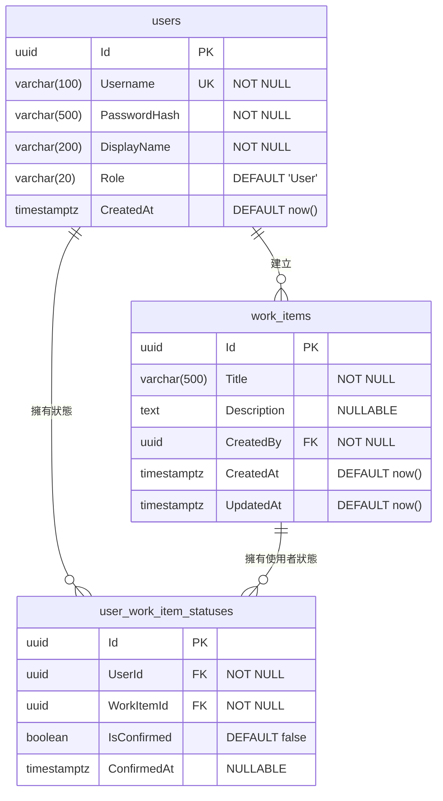

# 資料庫 Schema

## ERD（實體關聯圖）



## 資料表說明

### `users` — 使用者帳號

| 欄位 | 型別 | 約束 | 說明 |
|------|------|------|------|
| Id | UUID | PK, default gen_random_uuid() | 唯一識別碼 |
| Username | VARCHAR(100) | NOT NULL, UNIQUE | 登入帳號 |
| PasswordHash | VARCHAR(500) | NOT NULL | BCrypt 雜湊密碼 |
| DisplayName | VARCHAR(200) | NOT NULL | 介面顯示名稱 |
| Role | VARCHAR(20) | NOT NULL, default 'User' | 角色：`Admin` 或 `User` |
| CreatedAt | TIMESTAMPTZ | NOT NULL, default now() | 建立時間 |

### `work_items` — 工作項目

全域工作項目，由管理員管理，所有使用者皆可見。

| 欄位 | 型別 | 約束 | 說明 |
|------|------|------|------|
| Id | UUID | PK, default gen_random_uuid() | 唯一識別碼 |
| Title | VARCHAR(500) | NOT NULL | 項目標題 |
| Description | TEXT | NULLABLE | 詳細描述 |
| CreatedBy | UUID | FK → users(Id), NOT NULL | 建立者 |
| CreatedAt | TIMESTAMPTZ | NOT NULL, default now() | 建立時間 |
| UpdatedAt | TIMESTAMPTZ | NOT NULL, default now() | 最後修改時間 |

### `user_work_item_statuses` — 個人化狀態

每位使用者對每個工作項目的狀態。**延遲建立**：若某 (user, work_item) 組合無紀錄，視為「Pending」。

| 欄位 | 型別 | 約束 | 說明 |
|------|------|------|------|
| Id | UUID | PK, default gen_random_uuid() | 唯一識別碼 |
| UserId | UUID | FK → users(Id), CASCADE DELETE | 使用者 |
| WorkItemId | UUID | FK → work_items(Id), CASCADE DELETE | 工作項目 |
| IsConfirmed | BOOLEAN | NOT NULL, default false | 是否已確認 |
| ConfirmedAt | TIMESTAMPTZ | NULLABLE | 確認時間 |

**唯一約束**：`(UserId, WorkItemId)` — 每位使用者對每個項目僅一筆狀態。

### 索引

| 資料表 | 欄位 | 類型 |
|--------|------|------|
| users | Username | UNIQUE |
| user_work_item_statuses | (UserId, WorkItemId) | UNIQUE |
| user_work_item_statuses | UserId | INDEX |
| user_work_item_statuses | WorkItemId | INDEX |

## 設計決策：延遲建立狀態

管理員新增工作項目時，**不會**為所有使用者預建 `user_work_item_statuses` 紀錄。查詢策略：

- 使用 EF Core **Filtered Include** 進行 LEFT JOIN，僅關聯當前使用者的狀態
- 無狀態紀錄 → 視為 **Pending**
- 僅在使用者**確認**項目時才建立狀態紀錄
- 優點：無需背景作業，新增/移除使用者時無需清理

```sql
SELECT w.*, s.*
FROM work_items w
LEFT JOIN user_work_item_statuses s
  ON s.work_item_id = w.id AND s.user_id = @currentUserId
```
